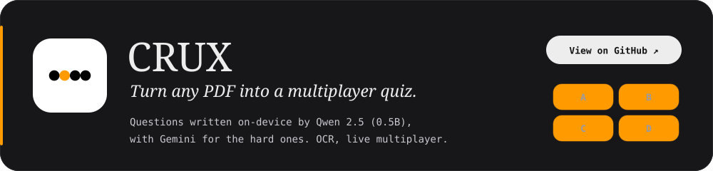
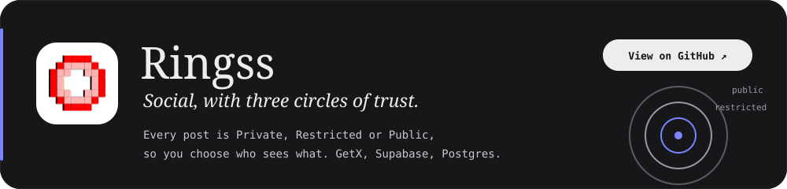

  
  
  

 

Most apps fall apart the moment the signal drops. I like building the kind that don't: the model runs on the phone first, the data stays there, and the cloud is something they reach for, not something they need. Right now that's **Flutter**, **native Android**, and squeezing **AI** onto the device.

 

## Projects

**[Echo](https://echo-mobileapp.vercel.app)** — Reads your notifications, messages and calendar all day, then gives you one short spoken briefing, a to-do list, and answers when you ask. Runs on your phone with an on-device model, or with Gemini when you choose; a desktop app on the same Wi-Fi does the heavier thinking.  
`Flutter` `Kotlin` `On-device LLM` `Gemini API` `Isar`

 

**[CRUX](https://github.com/chandan-gs/crux.app)** — An AI quiz and trivia platform that turns any PDF or document into an interactive multiplayer game. Questions are generated on-device by the Qwen 2.5 (0.5B) edge model, with a fallback to the Gemini API for complex ones. OCR pipeline, real-time multiplayer on Firestore, and daily push notifications.  
`Flutter` `Qwen 2.5` `Gemini API` `Firebase` `Google ML Kit`

 

**[Ringss](https://github.com/chandan-gs/ringss)** — A privacy-first social app built on a three-tier content model, Private, Restricted and Public, so people control exactly who sees what. Reactive state with GetX and a Supabase backend for auth and PostgreSQL storage.  
`Flutter` `GetX` `Supabase` `PostgreSQL`

 

## Stack

<table>
  <tr>
    <td><b>MOBILE</b></td>
    <td>
      
      
      
      
      
    </td>
  </tr>
  <tr>
    <td><b>ON-DEVICE AI</b></td>
    <td>
      
      
      
    </td>
  </tr>
  <tr>
    <td><b>BACKEND</b></td>
    <td>
      
      
      
      
    </td>
  </tr>
  <tr>
    <td><b>TOOLS</b></td>
    <td>
      
      
      
      
      
    </td>
  </tr>
</table>

 

## Activity

  
  

  <picture>
    <source media="(prefers-color-scheme: dark)" srcset="https://raw.githubusercontent.com/chandan-gs/chandan-gs/output/github-snake-dark.svg"/>
    <source media="(prefers-color-scheme: light)" srcset="https://raw.githubusercontent.com/chandan-gs/chandan-gs/output/github-snake.svg"/>
    
  </picture>

